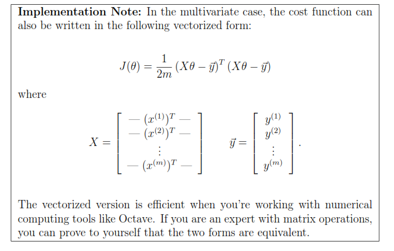

**Note:** Implement assignment using Python. Don’t copy code from internet or any other source. You should know each and every line (or implemented concept). Those who will try they will get some marks for their effort even you don’t get perfect solution. You can discuss with your colleagues but when you implement, implement it yourself and you should know each and every concept.

Don’t use built-in function for training, you have to write iterative algorithm yourself.

Question 1

Part I: Linear Regression with One Variable

**Introduction**

In this exercise, you will implement linear regression and get to see it work on data. Before starting on this programming exercise, go through the lectures.

Linear regression with one variable

In this part of this exercise, you will implement linear regression with one variable to predict profits for a bakery franchise. 

Suppose you are the Chief Executive Officer of a bakery and are considering different cities for opening a new outlet. The chain already has outlets in various cities and you have data for profits and populations from the cities. You would like to use this data to help you select which city to expand to next.

The file ex1data1.txt contains the dataset for our linear regression problem. The first column is the population of a city and the second column is the profit of an outlet in that city. A negative value for profit indicates a loss.

Plotting the Data

Before starting on any task, it is often useful to understand the data by visualizing it. For this dataset, you can use a scatter plot to visualize the data, since it has only two properties to plot (profit and population). (Many other problems that you will encounter in real life are multi-dimensional and can’t be plotted on a 2-d plot.)

The plot should look like Figure 1, with the same red “x” markers and axis labels.

Gradient Descent

In this part, you will fit the linear regression parameters θ to our dataset using gradient descent.

` `**Update Equations**

The objective of linear regression is to minimize the cost function

` `**Implementation (COMPUTING cost and Gradient descent)**

After you have implemented gradient descent algo and trained the model, the plot should look as shown in Fig 2.

Part II: Linear Regression with Multiple Variables

**1. Linear regression with multiple variables**

In this part, you will implement linear regression with multiple variables to predict the prices of houses. Suppose you are selling your house and you want to know what a good market price would be. One way to do this is to first collect information on recent houses sold and make a model of housing prices.

The file ex1data2.txt contains a training set of housing prices in a city. The first column is the size of the house (in square feet), the second column is the number of bedrooms, and the third column is the price of the house.

1.1 Feature Normalization

By looking at the data values, note that house sizes are about 1000 times the number of bedrooms. When features differ by orders of magnitude, first performing feature scaling can make gradient descent converge much more quickly.

Your task here is to complete the code in featureNormalize.m to

- Subtract the mean value of each feature from the dataset.
- After subtracting the mean, additionally scale (divide) the feature values by their respective “standard deviations.”

**Implementation Note:** When normalizing the features, it is important to store the values used for normalization - the mean value and the standard deviation used for the computations. After learning the parameters from the model, we often want to predict the prices of houses we have not seen before. Given a new x value (living room area and number of bedrooms), we must first normalize x using the mean and standard deviation that we had previously computed from the training set.

1.2 Gradient Descent

Previously, you implemented gradient descent on a univariate regression problem. The only difference now is that there is one more feature in the matrix X. The hypothesis function and the batch gradient descent update rule remain unchanged.

You should implement the cost function and gradient descent for linear regression with multiple variables. If your code in the previous part (single variable) already supports multiple variables, you can use it here too. 

Make sure your code supports any number of features and is well-vectorized.

..

**3.2.1 Selecting learning rates**

In this part of the exercise, you will get to try out different learning rates for the dataset and find a learning rate that converges quickly. 

Run gradient descent for about 50 iterations at the chosen learning rate. After the last iteration, implement the script that plots the J values against the number of the iterations.

If you picked a learning rate within a good range, your plot look similar Figure 4. If your graph looks very different, especially if your value of J(θ) increases or even blows up, adjust your learning rate and try again. We recommend trying values of the learning rate a on a log-scale, at multiplicative steps of about 3 times the previous value (i.e., 0.3, 0.1, 0.03, 0.01 and so on). You may also want to adjust the number of iterations you are running if that will help you see the overall trend in the curve.

Notice the changes in the convergence curves as the learning rate changes. With a small learning rate, you should find that gradient descent takes a very long time to converge to the optimal value. Conversely, with a large learning rate, gradient descent might not converge or might even diverge!

Using the best learning rate that you found, run gradient descent until convergence to find the final values of θ. Next, use this value of θ to predict the price of a house with 1650 square feet and 3 bedrooms. You will use value later to check your implementation of the normal equations. Don’t forget to normalize your features when you make this prediction!

3.3 Normal Equations

We know that the closed-form solution to linear regression is

Using this formula does not require any feature scaling, and you will get an exact solution in one calculation: there is no “loop until convergence” like in gradient descent.

Implement the code to use the formula above to calculate θ. Remember that while you don’t need to scale your features, we still need to add a columns of 1’s to the X matrix to have an intercept term (θ).

Now, once you have found θ using this method, use it to make a price prediction for a 1650-square-foot house with 3 bedrooms. You should find that gives the same predicted price as the value you obtained using the model fit with gradient descent.

